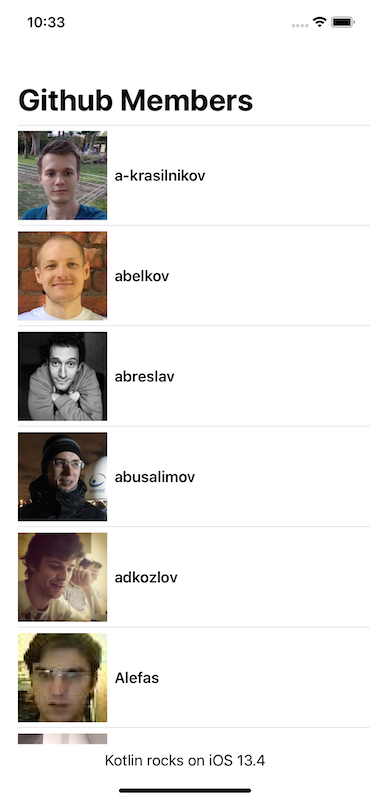

# Kotlin Multiplatform Sample

* Implements Android and iOS targets
* Uses MVVM Design pattern (Lifecycle Arch component and LiveData on Android, SwiftUI and Combine on iOS)
* Shares Models and Repository layer
* Uses [Ktor Http client](https://ktor.io/clients/index.html) library for making remote calls
* Uses [SqlDelight](https://github.com/cashapp/sqldelight) library for local data persistence for both Android and iOS
* Uses Cocoapods plugin for building iOS targets. For cocoapods setup instructions, see [this readme](https://github.com/jshvarts/KmpGithub)

## Screenshots

Android                    |  iOS
:-------------------------:|:-------------------------:
 | 

## Installation

Run `gradlew build` from the root of the project. After a successful build, you should be able to install the app on both Android and iOS.

> If you are unable to run the project in Xcode, you may need to add `-lsqlite3` to `Other Linker Flags` as mentioned [here](https://github.com/cashapp/sqldelight/issues/1442#issuecomment-523435492)

## Next Steps

Check out [KaMPKit](https://github.com/touchlab/KaMPKit) for more examples as well as unit tests.
